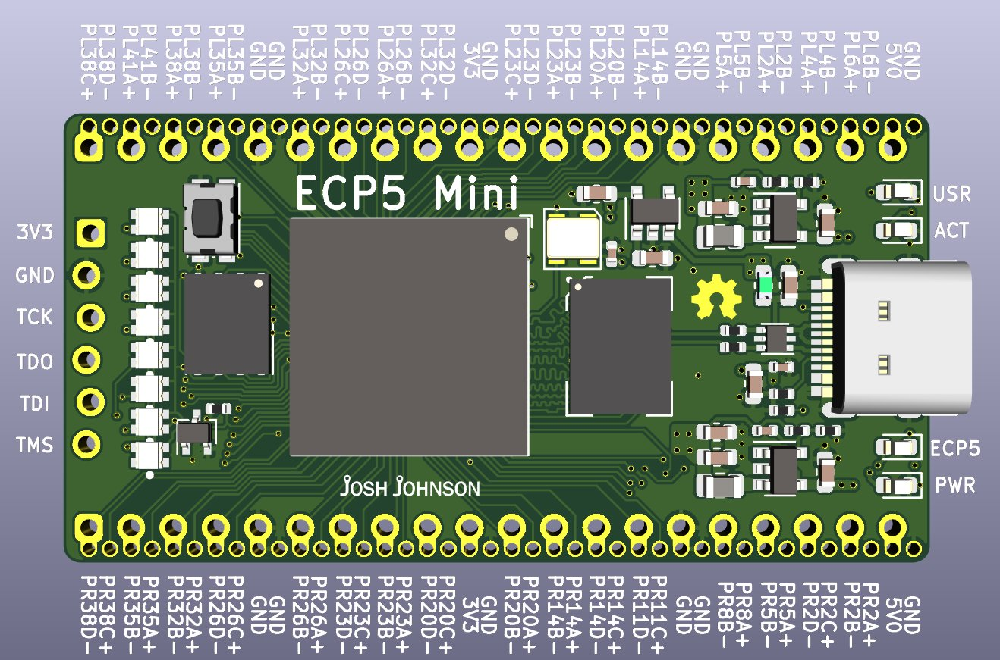

# ECP5 Mini

``` 
Status: Work in progress, design not finalised. Bringup ETA end of September. 
Designed in Kicad nightly.
```




ECP5 Mini is a Lattice ECP5 FPGA in the [Black Mesa Labs "S7 Mini" form factor](https://blackmesalabs.wordpress.com/2019/05/19/bml-s7-mini-fpga-module/).

## Key Features
- Lattice ECP5-12/25F FPGA in a caBGA256 package.
- 32 / 64 3V3 IO on 2.54mm / 1.27mm pitch grid.
- 64 Mbit HyperRAM DRAM (3V3 / 100 MHz only).
- USB Full Speed (12Mbit) connection to FPGA over Type-C connector.
- MicroSD card support (on back of board).
- 8 Multiplexed RGB LEDs.
- Designed to work with OSHPark's 4 layer service.

## Why?
After getting over my fears of BGA after assembling a [Glasgow](https://github.com/GlasgowEmbedded/Glasgow) recently, I decided the next logical step was to design a BGA into a board of my own. An ECP5 was the obvious choice to follow on from my [iCE40-feather](https://github.com/joshajohnson/ice40-feather) designed last year as it steps up the resources and available IO. There are also a growing number of open ECP5 dev boards and projects that I have / can learn from during the hardware and gateware development. 

## Thanks
Not only was this project inspired by the growing number of OSHW FPGA designs, but I referenced a number of them during the hardware development. A huge thank you needs to be given to these people as otherwise my design would likely have even more bugs...
- Black Mesa Lab's [S7 Mini](https://blackmesalabs.wordpress.com/2019/05/19/bml-s7-mini-fpga-module/) for the form factor and feature set inspiration.
- Greg Davil and his [OrangeCrab](https://github.com/gregdavill/OrangeCrab) and [Butterstick](https://github.com/gregdavill/butterstick) development boards. 
- Matt Venn's [Basic ECP5](https://github.com/mattvenn/basic-ecp5-pcb) design. 
- SpriteTM / Hackaday's [2019 Supercon Badge](https://github.com/Spritetm/hadbadge2019_pcb).
- Luke Valenty's [TinyFPGA-EX](https://github.com/tinyfpga/TinyFPGA-EX).
- 1BitSquared's [HyperRAM PMOD](https://1bitsquared.com/collections/fpga/products/pmod-hyperram) for symbol and footprint.
- ECP5 Symbol from xesscorp's [Kicad Schematic Symbol Library](https://github.com/xesscorp/KiCad-Schematic-Symbol-Libraries).