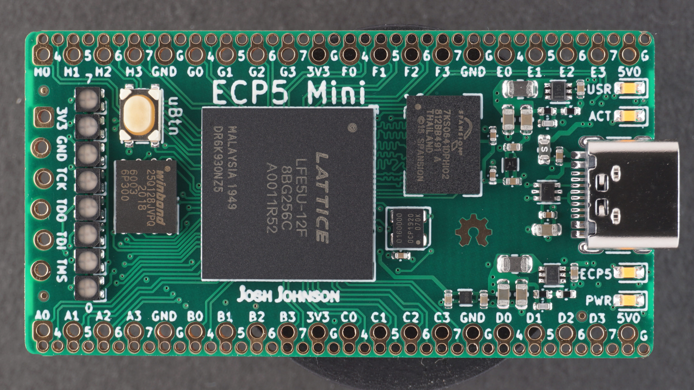
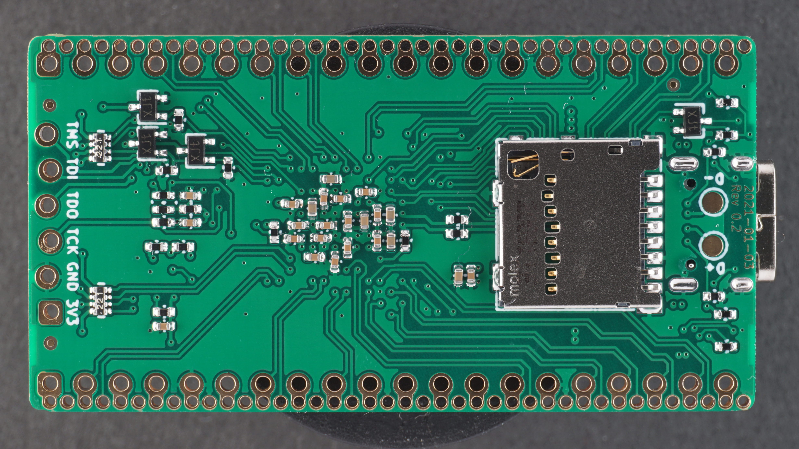

# ECP5 Mini

``` 
Status: All functions on r0.2 have been proven to work. Safe to assemble your own! 

Designed in Kicad nightly, ensure you clone --recursive.
```





ECP5 Mini is a Lattice ECP5 FPGA in the [Black Mesa Labs "S7 Mini" form factor](https://blackmesalabs.wordpress.com/2019/05/19/bml-s7-mini-fpga-module/).

## Key Features
- Lattice ECP5-12/25F FPGA in a caBGA256 package.
- 32 / 64 3V3 IO on 2.54mm / 1.27mm pitch grid.
- 64 Mbit HyperRAM DRAM.
- USB Full Speed (12Mbit) connection to FPGA over Type-C connector.
- MicroSD card support.
- 8 Multiplexed RGB LEDs.

## Revision History

r0.1 is depreciated. ~~hardware has been assembled with no major issues being found at time of writing. Requires more validation, particularly the HyperRAM, microSD, and signal integrity of IO.~~

r0.2 moves to 1v8 HyperRAM along with major IO changes to improve performance. Pinout is not compatiable with r0.1, but mechanically is identical. Projects utiliting the features of the board to be completed.

## Information

USB [dfu bootloader](https://github.com/joshajohnson/had2019-playground/tree/ecp5-mini) courtesy of [tnt](https://github.com/smunaut/) is working.

Example gateware can be found [here](https://github.com/joshajohnson/ecp5-mini-projects), however please note I built this board to force myself to write more HDL so it's probably full of bad practices.

Check the [issues](https://github.com/joshajohnson/ecp5-mini/issues) for any errata / improvements to the design.

## Thanks
Not only was this project inspired by the growing number of OSHW FPGA designs, but I referenced a number of them during the hardware development. A huge thank you needs to be given to these people as otherwise my design would likely have even more bugs...
- Black Mesa Lab's [S7 Mini](https://blackmesalabs.wordpress.com/2019/05/19/bml-s7-mini-fpga-module/) for the form factor and feature set inspiration.
- Greg Davil and his [OrangeCrab](https://github.com/gregdavill/OrangeCrab) and [Butterstick](https://github.com/gregdavill/butterstick) development boards. 
- Matt Venn's [Basic ECP5](https://github.com/mattvenn/basic-ecp5-pcb) design.
- SpriteTM / Hackaday's [2019 Supercon Badge](https://github.com/Spritetm/hadbadge2019_pcb).
- Luke Valenty's [TinyFPGA-EX](https://github.com/tinyfpga/TinyFPGA-EX).
- 1BitSquared's [HyperRAM PMOD](https://1bitsquared.com/collections/fpga/products/pmod-hyperram) for symbol and footprint.
- ECP5 Symbol from xesscorp's [Kicad Schematic Symbol Library](https://github.com/xesscorp/KiCad-Schematic-Symbol-Libraries).